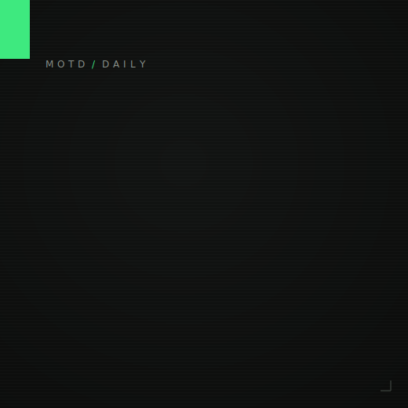
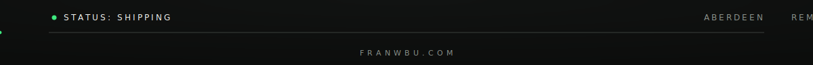

<samp>[portfolio](https://franwbu.com/portfolio) · [blog](https://franwbu.com) · [linkedin](https://www.linkedin.com/in/fran-dev/) · [email](mailto:hello@franwbu.com) · [anonfeedback.io](https://anonfeedback.io)</samp>

 

<table>
<tr>
<td width="320" valign="middle">

</td>
<td valign="top">

<samp>ABOUT</samp>

I build software that is not just functional but intuitive and beautiful. The questions I keep coming back to: _"does this feel natural to use?"_, _"who might struggle here, and why?"_, _"how do we hide complexity without dumbing it down?"_

Programming independently since 2012, in industry since 2022. Computer Science BSc, First Class Honours. Currently building production agentic systems, AI agents that manage sprints, review code and ship features, and running [anonfeedback.io](https://anonfeedback.io).

<samp>Selected work with live demos lives on the [portfolio](https://franwbu.com/portfolio).</samp>

</td>
</tr>
</table>

 

